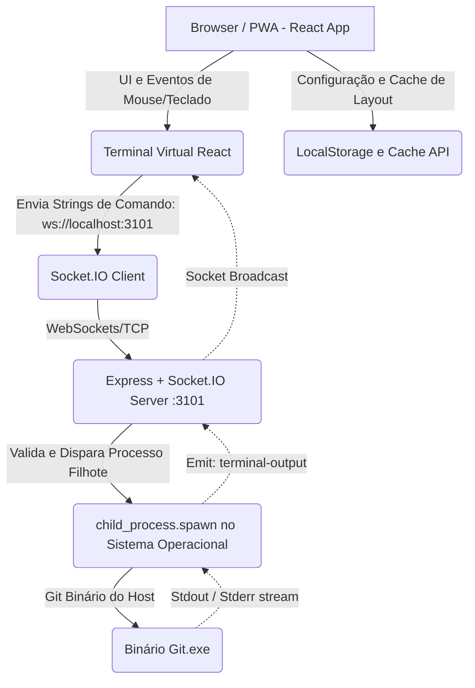

# Arquitetura do Sistema (Architecture)

Este documento aprofunda o modelo arquitetural do **GitKraken Client Studio (PWA)**, dissecando as camadas lógicas entre a Interface de Usuário, a Ponte Node.js e o Sistema Operacional Subjacente.

## 🏗️ 1. Paradigma Arquitetural
A aplicação segue uma arquitetura híbrida de **SPA (Single Page Application)** enriquecida (via PWA) conectada a uma arquitetura **Event-Driven Client-Server** (Servidor de Eventos baseado em Sockets).
- **Frontend (Isolado e Seguro):** O código que roda no browser é inteiramente visual e gerencia puramente estado local, cache e renderização SVG.
- **Backend (Ponte Privilegiada):** O servidor Node.js atua como uma ponte de comunicação com o Sistema Operacional, detendo permissão de I/O de shell e de disco local, o qual o browser não possui.

## 🧬 2. Diagrama de Camadas

## 🧩 3. Componentes Arquiteturais Críticos

### 3.1. App Central (`App.tsx`)
- É a espinha dorsal de Roteamento Visual e Gestão de Estado Global.
- Utiliza hooks maciços (`useState`, `useEffect`) para controlar se o ambiente está em Light/Dark mode, a Tab atual ("Gitkraken" vs "Settings") e armazenar as variáveis temporárias de Simulação Local.

### 3.2. Gerenciador de Grade Dinâmica (`DraggableDashboard.tsx`)
- Encapsula o `react-grid-layout` v2.
- Adota um paradigma **Data-Driven UI**: O layout visual inteiro e a posição relativa de cada painel (x, y, w, h) derivam de um simples Objeto JSON injetado na propriedade `layouts={layouts}`.
- Contém um `ResizeObserver` arquiteturalmente inserido no nível da ref da div pai para prevenir que flexbox da Tailwind colapse a altura, garantindo grid contínua (desktop-first).

### 3.3. PWA Worker (`vite-plugin-pwa`)
- Intercepta requisições de rede feitas pela aplicação (CSS, JS, Fontes) e responde servindo através do Cache API do Browser (Service Worker). Isso permite abrir a tela do GitKraken PWA mesmo sem internet (embora a comunicação Node/Socket seja interrompida até a conexão retornar ou o servidor iniciar).
